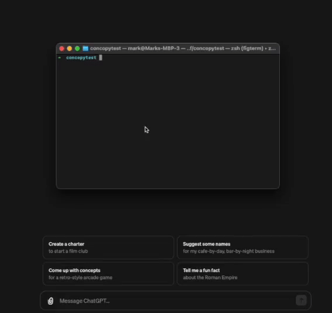
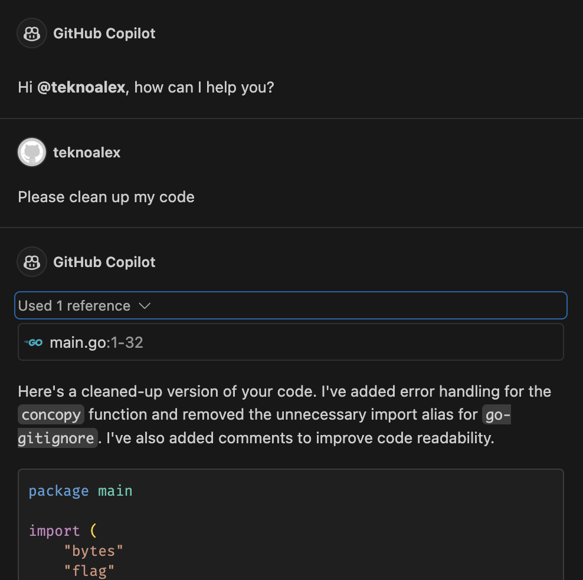

# concopy

concopy (concat-copy) is a small CLI tool thata allows you to quickly paste your codebase into your preferred Generative AI assistant. Use ChatGPT, Bard or any company-internal LLM to write code for you, while being able to choose which context about your codebase to supply.



This can sometimes be useful when you want to generate code for a specific part of your codebase, but you don't want to share the entire codebase with the AI.
Also it can be better than GitHub Copilot in some cases, as it allows you to choose the context of the code you want to generate.
Copilot's RAG sometimes looks at wrong parts of the codebase, leading to unwanted results.



Notice in the screenshot, Copilot only injects line 1 to 32 into the prompt, although the file has much more lines.

## Installation

### Using Homebrew

You can install `concopy` using Homebrew by tapping into our repository and then installing the formula:

```sh
brew tap markwitt1/tap https://github.com/markwitt1/homebrew-tap
brew install concopy
```

### Other

Download the binary for your platform and put it somewhere in your PATH.

Run `chmod +x path/to/binary` to make the binary executable.

## Usage

### By command line arguments

Run `concopy <file1> <file2> <folder1>` to copy the content of the specified files to the clipboard.

### Using .concopyuse

Add a `.concopyuse` file at your project root and populate it with the file / directory paths separated with line breaks.

For example:

```

go.mod
.github
main.go

```

NOTE: On the first run on macOS, the execution will be blocked by the system. You will need to go to `System Settings -> Privacy & Security -> Security` and allow the execution of the binary.

```

```
